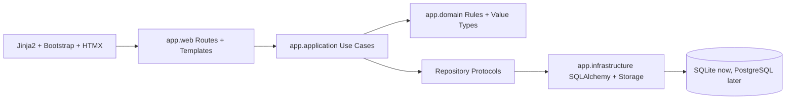

# Architecture

AquaOps is a server-rendered FastAPI application structured as a modular monolith. It keeps
deployment simple while preserving boundaries that matter for long-term maintenance.

## Layer Diagram

## Package Responsibilities

- `app.web`: HTTP routes, browser dependencies, templates, static assets
- `app.application`: use cases and read/write service orchestration
- `app.domain`: event types, measurement keys, reminder rules, framework-free data types
- `app.infrastructure`: SQLAlchemy models, repositories, auth/session persistence, storage
- `alembic`: schema migrations
- `tests`: unit, application, and web tests

## Event-Centered Design

The `events` table is the shared timeline for all time-based records:

- water tests
- feedings
- maintenance
- fertilizer/root-tab dosing
- notes
- photos

Reportable type-specific data lives in detail tables such as `event_measurements`,
`maintenance_event_details`, and `fertilizer_event_details`. This keeps timeline queries
simple without hiding important data inside an opaque JSON column.

## Authentication

Local auth uses bcrypt password hashes and server-side sessions. The browser receives a
random session token. The database stores only an HMAC-SHA256 hash of that token, scoped by
the application secret key.

