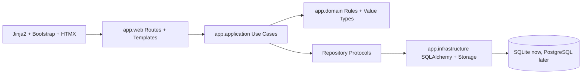

# Architecture

AquaOps is a server-rendered FastAPI application structured as a modular monolith. It keeps
deployment simple while preserving boundaries that matter for long-term maintenance.

## Layer Diagram

## Package Responsibilities

- `app.web`: HTTP routes, browser dependencies, templates, static assets
- `app.application`: use cases and read/write service orchestration
- `app.domain`: event types, measurement keys, reminder rules, user preference rules, framework-free data types
- `app.infrastructure`: SQLAlchemy models, repositories, auth/session persistence, storage
- `alembic`: schema migrations
- `tests`: unit, application, and web tests

## Event-Centered Design

The `events` table is the shared timeline for all time-based records:

- water tests
- feedings
- maintenance
- fertilizer/root-tab dosing
- notes
- photos

Reportable type-specific data lives in detail tables such as `event_measurements`,
`maintenance_event_details`, and `fertilizer_event_details`. This keeps timeline queries
simple without hiding important data inside an opaque JSON column.

## Tank-Specific Targets

Water parameters are interpreted through `tank_parameter_targets`, not global constants.
Each tank can carry its own acceptable ranges for ammonia, nitrite, nitrate, pH,
temperature, KH, GH, and TDS. The dashboard and tank detail pages can then classify
readings against the tank's actual goals.

## Species Catalog

The `species_catalog` table is the local starter database for livestock and plants. It
stores common and scientific names, care level, minimum tank size, temperature and pH
ranges, social group guidance, plant lighting needs, and source metadata. Livestock and
plant rows can link back to catalog entries while preserving editable text fields, so a
user can pick from dropdowns or enter something custom without blocking the workflow.

`species_aliases` provides a future lookup surface for alternate common names and imported
taxonomy identifiers. External references are stored as structured metadata so the app can
later enrich the catalog without changing the inventory tables.

## Preferences and Feature Filtering

Per-user workspace preferences live in `user_preferences`. The domain keeps canonical
values stable where it matters, such as tank volume in liters, while presentation helpers
convert display values for gallons/liters, Fahrenheit/Celsius defaults, and date formats.

Feature module settings are consumed at the route and repository boundaries. Plant Care is
modeled as `Auto`, `On`, or `Off`; auto mode enables fertilizer/root-tab surfaces only
when plants, planted tanks, or fertilizer history indicate that the workflow is relevant.
This keeps reminders, dashboard events, reports, and notification queues quiet for users
who do not need plant-care operations.

## Authentication

Local auth uses bcrypt password hashes and server-side sessions. The browser receives a
random session token. The database stores only an HMAC-SHA256 hash of that token, scoped by
the application secret key.
