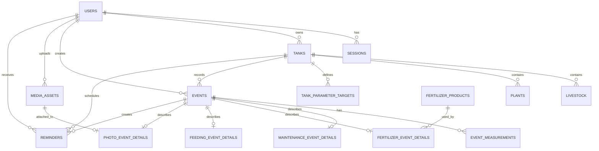

# Database ERD

## Core Tables

- `users`: login identity and account ownership
- `sessions`: hashed server-side session tokens
- `tanks`: aquariums owned by a user
- `livestock`: fish, shrimp, snails, and other aquatic animals
- `plants`: aquatic plants per tank
- `tank_parameter_targets`: acceptable per-tank ranges for water parameters
- `events`: generic chronological record
- `event_measurements`: ammonia, nitrite, nitrate, pH, temperature, KH, GH, TDS
- `maintenance_event_details`: water changes, cleaning, filter work, substrate vacuum, equipment replacement, plant trimming
- `fertilizer_products`: built-in and custom fertilizer products
- `fertilizer_event_details`: dose, product, tank location, and next due date
- `feeding_event_details`: food and amount
- `media_assets`: local media metadata
- `photo_event_details`: photo captions linked to events
- `reminders`: upcoming and completed operational reminders
