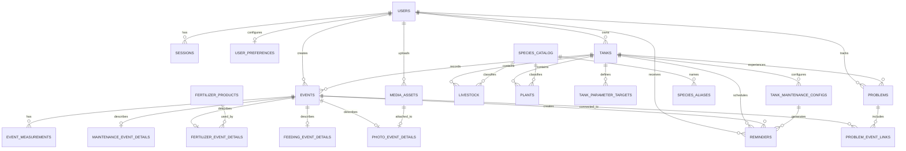

# Database ERD

This schema is managed by Alembic and runs canonically on PostgreSQL 17. Timestamps use
timezone-aware PostgreSQL values, measurements use fixed-precision `NUMERIC`, and event
metadata remains structured JSON. Local media files are stored outside the database.

## Core Tables

- `users`: login identity and account ownership
- `user_preferences`: per-user unit display, date format, dashboard density, notification window, feature modules, and Plant Care mode
- `sessions`: hashed server-side session tokens
- `tanks`: aquariums owned by a user
- `species_catalog`: built-in and future custom species metadata for fish, invertebrates, and plants
- `species_aliases`: alternate common names or lookup aliases for catalog entries
- `livestock`: fish, shrimp, snails, and other aquatic animals, optionally linked to catalog entries
- `plants`: aquatic plants per tank, optionally linked to catalog entries
- `tank_parameter_targets`: acceptable per-tank ranges for water parameters
- `tank_maintenance_configs`: standard and custom care schedules with cadence,
  reminder behavior, optional timing/notes, and profile/manual/legacy provenance
- `events`: generic chronological record
- `event_measurements`: ammonia, nitrite, nitrate, pH, temperature, KH, GH, TDS
- `maintenance_event_details`: water changes, cleaning, filter work, substrate vacuum, equipment replacement, plant trimming
- `fertilizer_products`: built-in and custom fertilizer products
- `fertilizer_event_details`: dose, product, tank location, and next due date
- `feeding_event_details`: food and amount
- `media_assets`: local media metadata
- `photo_event_details`: photo captions linked to events
- `problems`: structured tank issues with type, severity, status, resolution, and retained history
- `problem_event_links`: connects relevant tests, care, observations, photos, and status events to a problem
- `reminders`: upcoming and completed operational reminders, including linked schedule
  provenance and non-destructive supersession state
